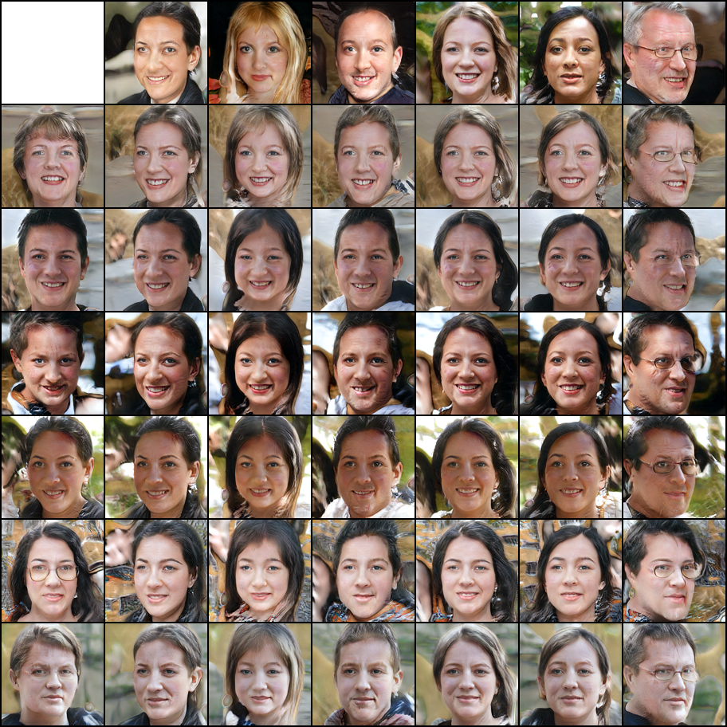

## 项目介绍
项目基于Jittor (https://cg.cs.tsinghua.edu.cn/jittor/) 框架，
实现StyleGAN(https://arxiv.org/abs/1812.04948)

## 如何运行

### 训练数据处理

`python perpare_data.py {path of FFHQ_128}`

### 训练
`python train_loop.py --config=config_FFHQ.py`

config_FFHQ中的data_root_path指定训练数据位置
### 测试隐向量插值效果

`python mix_style.py --model /home/fengshikun/Jittor_StyleGan/FFHQ_new_1227/models/resolution128_ep31  --trunc`

生成效果

### 生成渐进式训练的视频

`python generate_video.py`
在程序中指定训练过程中生成图片的目录，运行完后会生成project.avi文件

## 参考
PyTorch实现: https://github.com/rosinality/style-based-gan-pytorch

Jittor GAN模型库: https://github.com/Jittor/gan-jittor

